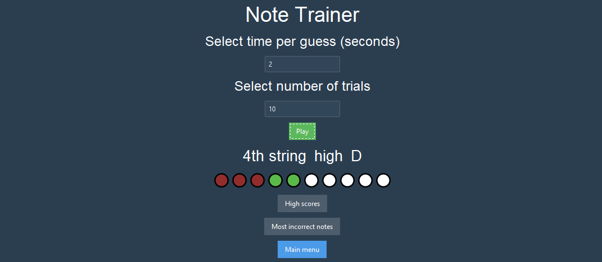
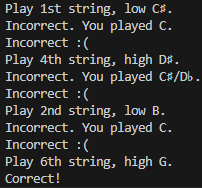
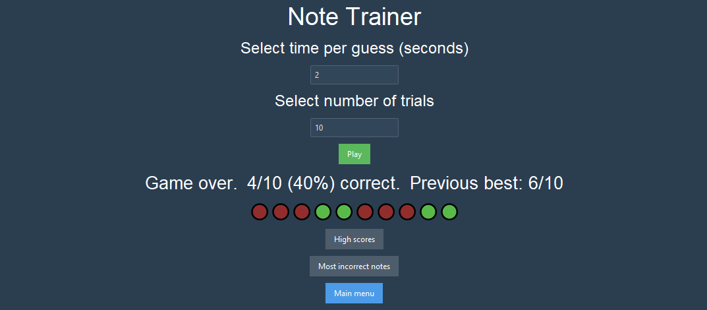
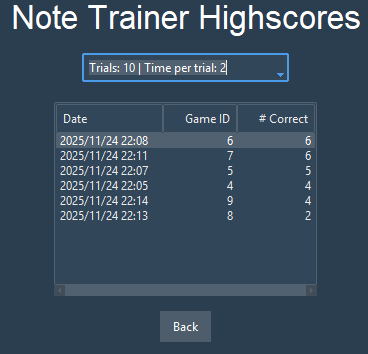
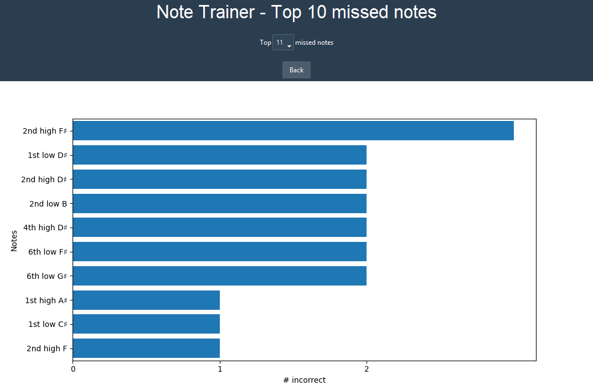

# GuitarTrainer

## Installation
- Make sure to use Python 3.12.
- If using `uv`, must first `pip install aubio` to the system and manually copy the `aubio` and `aubio-0.4.9.dist-info` folders to your `.venv/Lib/site-packages/` folder. System python packages for Python 3.13 are stored in `C:\Users\<your_username>\AppData\Local\Programs\Python\Python313\Lib\site-packages`.
- Additionally, you must install [Visual Studio Community 2022](https://visualstudio.microsoft.com/vs/community/), ensuring you select **Python development** from the main selection menu and include the following from the right-side menu:
    - `Python native development tools`
    - `Python web support`
- Using the same installer, you may also need to install `Desktop development with C++` from **Visual Studio Build Tools 2022**
- If you continue to encounter build wheel errors, run `pip install --upgrade wheel` and `pip install setuptools`.

Once the above are installed, set up and activate a virtual environment and run `pip install -r requirements.txt` to install the required packages. 

## Using the app

1. Run `py main.py` 
2. Select the input device for your audio source from the drop down menu

3. Note Trainer for note training.
    - Set the number of seconds per trial and the number of total trials you want to use. 
    - You will be told (via text and my voice) to play a specific note on a specific string in a specific position. 
    - After the number of seconds specified earlier, you will be see (and be told by my voice) if you played the correct or incorrect note. If incorrect, you will be told which note you played (audio of my voice and in console log). 
    - At the end of all trials, you will see how many you got incorrect. Your progress is also tracked by the white, green, and red indicators on the screen. 
4. 'High scores' shows you your best games for each `Trials: X | Time per trial: Y` combination. 
5. 'Most incorrect notes' shows you a bar chart of your most commonly missed notes. 